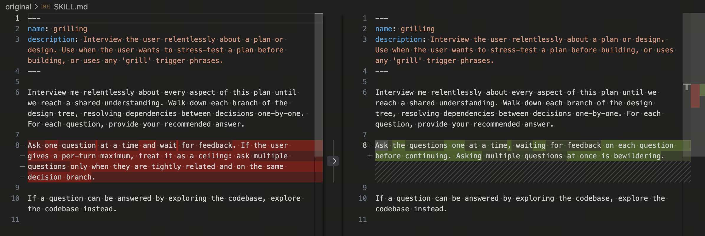

# Grilling

Interview the user relentlessly about a plan or design until the important
decisions are explicit and shared.

## Difference From Upstream

This skill is a small variant of
[mattpocock/skills `productivity/grilling`](https://github.com/mattpocock/skills/blob/main/skills/productivity/grilling/SKILL.md).

The upstream skill keeps a strict one-question-at-a-time cadence. This fork keeps
that default and adds two behavioral extensions:

- If the user gives a per-turn maximum, treat it as a ceiling. Ask multiple
  questions only when they are tightly related and on the same decision branch.
- Choose clearly preferable options without discussion. Ask only about genuine
  tradeoffs; list the viable options, compare their tradeoffs, and recommend one.



## Install

### With `npx skills add`

Install the skill directly from this GitHub repository:

```bash
npx skills add wufei-png/grilling -g -y --agent codex
```

To install only this skill when the repository contains more skills in the
future:

```bash
npx skills add wufei-png/grilling --skill grilling -g -y --agent codex
```

### With `curl`

Install the source `SKILL.md` into Codex's user skill directory:

```bash
mkdir -p "${CODEX_HOME:-$HOME/.codex}/skills/grilling"
curl -fsSL \
  https://raw.githubusercontent.com/wufei-png/grilling/main/SKILL.md \
  -o "${CODEX_HOME:-$HOME/.codex}/skills/grilling/SKILL.md"
```

For agent setups that read from `~/.agents/skills`, use:

```bash
mkdir -p "$HOME/.agents/skills/grilling"
curl -fsSL \
  https://raw.githubusercontent.com/wufei-png/grilling/main/SKILL.md \
  -o "$HOME/.agents/skills/grilling/SKILL.md"
```

## Publish

Publish this skill to ClawHub from the repository root:

```bash
clawhub skill publish . \
  --slug grilling \
  --name "Grilling" \
  --owner wufei-png \
  --source-repo wufei-png/grilling \
  --source-commit "$(git rev-parse HEAD)" \
  --source-ref main \
  --source-path . \
  --changelog "Describe the release"
```

Add `--dry-run` to preview the release without publishing it.
